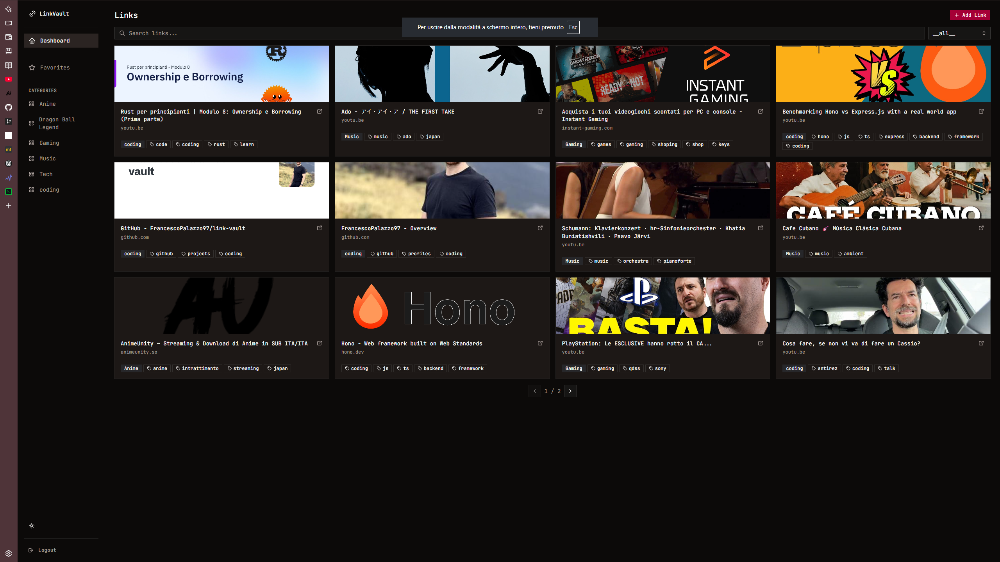
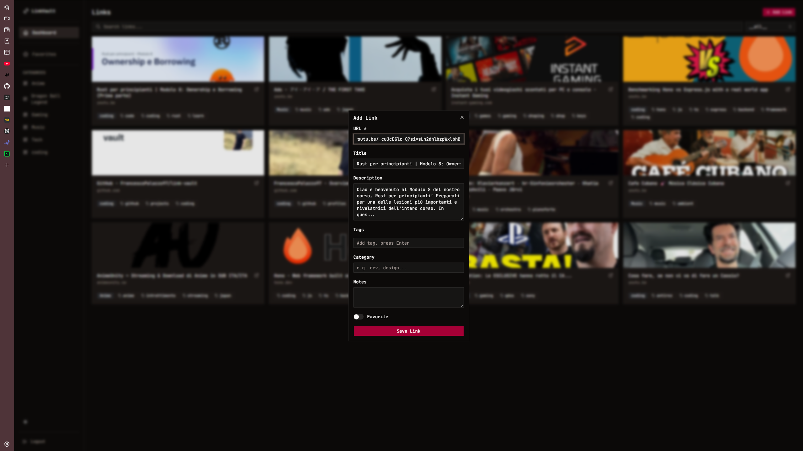
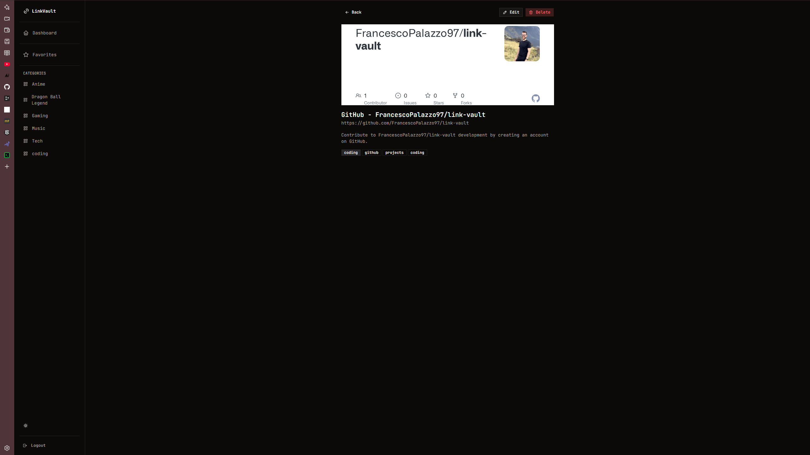

# LinkVault

> Personal web app for saving, organizing, and retrieving links with automatic Open Graph previews.


## Screenshots







<details>
<summary>Demo GIF</summary>


</details>

## Tech Stack

| Layer | Technologies |
|-------|-------------|
| **Frontend** | React 19, TypeScript, Tailwind CSS v4, Zustand, TanStack Query, shadcn/ui |
| **Backend** | Express 5, Node.js 24, Pino |
| **Database** | MongoDB 8, Mongoose |
| **Validation** | Zod (shared schemas) |
| **Testing** | Vitest (unit + integration), Playwright (E2E) |
| **DevOps** | Docker, GitHub Actions CI/CD, Nginx, Let's Encrypt |
| **Hosting** | Hetzner VPS (Helsinki) |

## Features

- Save links with automatic Open Graph preview (title, description, image)
- Organize with tags and categories
- Search across title, URL, tags, and notes
- Filter by category, tag, or favorites
- Pagination
- JWT single-user authentication
- Interactive API documentation (Swagger UI)
- Dark / Light mode
- Responsive design (mobile sidebar)
- Rate limiting and security headers
- CI/CD with automated testing and Docker deployment

## Architecture

```
┌─────────────┐     ┌─────────────┐     ┌─────────────┐
│   Client    │────▶│   Server    │────▶│  MongoDB    │
│  (Nginx)    │     │  (Express)  │     │             │
│  React SPA  │◀────│  REST API   │◀────│  Mongoose   │
└─────────────┘     └─────────────┘     └─────────────┘
```

Monorepo structure with three packages:
- `client/` — React 19 + Vite + Tailwind + Zustand
- `server/` — Express 5 + TypeScript + Mongoose
- `shared/` — Zod schemas and types (used by both)

## Quick Start

### Prerequisites

- Node.js 24+
- Docker + Docker Compose

### Setup

```bash
# Clone
git clone https://github.com/FrancescoPalazzo97/link-vault.git
cd link-vault

# Install dependencies
npm ci

# Configure environment
cp .env.example server/.env
# Edit server/.env with your values (see .env.example for instructions)

# Start MongoDB
docker compose -f docker-compose.yml up -d

# Build shared schemas (required before dev)
npm run build --workspace=shared

# Start development servers
npm run dev
```

- Frontend: http://localhost:5173
- Backend: http://localhost:3000
- API Docs: http://localhost:3000/api/docs
- Mongo Express: http://localhost:8081

## Testing

```bash
# Unit + Integration tests
npm test

# Unit tests only
npm run test:unit --workspace=server

# Integration tests (requires MongoDB)
npm run test:int --workspace=server

# Coverage report
npm run test:coverage --workspace=server

# E2E tests (Playwright)
npm run test:e2e

# View E2E report
npm run test:e2e:report
```

## API Documentation

Interactive Swagger UI available at `/api/docs` ([live](https://www.fitnesspro.it/api/docs)).

| Method | Endpoint | Description |
|--------|----------|-------------|
| `POST` | `/api/auth/login` | Login (returns JWT) |
| `POST` | `/api/auth/logout` | Logout |
| `GET` | `/api/links` | List links (search, filter, paginate) |
| `GET` | `/api/links/:id` | Get single link |
| `POST` | `/api/links` | Create link (auto OG preview) |
| `PATCH` | `/api/links/:id` | Update link |
| `DELETE` | `/api/links/:id` | Delete link |
| `POST` | `/api/links/preview` | Fetch OG preview for URL |
| `GET` | `/api/links/tags` | All unique tags |
| `GET` | `/api/links/categories` | All unique categories |
| `GET` | `/api/health` | Health check |

## Production Deploy

The app runs on a Hetzner VPS with Docker Compose, Nginx reverse proxy, and Let's Encrypt SSL.

```bash
# Production stack
docker compose -f docker-compose.prod.yml up -d
```

CI/CD pipeline (GitHub Actions):
1. Lint + Unit tests + Integration tests + Coverage
2. Build Docker images → Push to GHCR
3. SSH deploy to VPS → Pull + restart → Health check

## License

[MIT](LICENSE)
